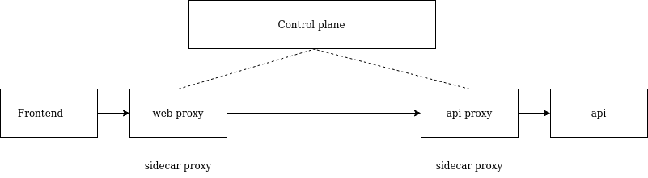

# Service mesh

A service mesh is an infraestructure layer that enables you to control the network communication of your workloads from a single control plane.

A service mesh is made up of a _sidecar proxies_ and the _control plane_.

## Sidecar proxies

A proxy is an application that traffic is routed through on the way to its destination.

Each instance of a service must be deployed with its own local proxy. This is known as the sidecar pattern.

## Control plane

The control plane's job is to manage and configure the sidecar proxies.

### Service mesh with metrics

Notice how we don't really need to change source code of the application.

## Why use a Service mesh?

### Security

Imagine that you have a ton of services connected between them and they are exchanging information in a non-secure manner. Instead of having to generate TLS certificates for each of the services, handle _Authentication_ and _Authorization_, we can just create a service mesh and encrypt the traffic between the sidecar proxies. Example:

### Observability

It is the ability to understand what's happening to your services while they're running.

Capturing observability data is the perfect job for a service mesh, because it controls the network traffic! Remember that we have sidecar proxies...

### Reliability

Building reliable distributed systems means reducing failure where possible and handling failure gracefully when it inevitably happens.

### Traffic control

- Canary deployment
- It is useful when the developer team has to migrate an app from monolith to microservices (for example), because the sidecar proxy can route where the request goes.

### Conclusion

A simple formula for knowing when to use a service mesh is when:

- you need to solve a networking problem in the area outlined previously (Security, observability, reliability, traffic control).
- your organization is at a scale, or will soon be at a scale, where it's soo costly to solve this problems in service code.

Other options could be implementing a library to share between all the services. This could be a good approach if we use one or two programming languages (we have to write the library for each of them), and if we use a few services. If we are running 400 services (random number), it would be nearly impossible to use that shared library across this services because each time we modify the library (we will), we will need to redeploy each service (bufff).

