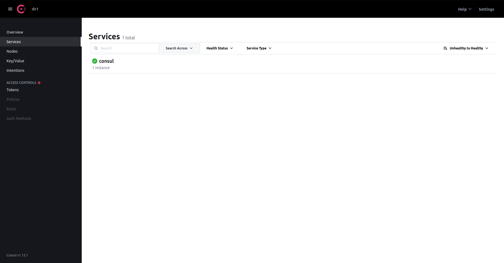
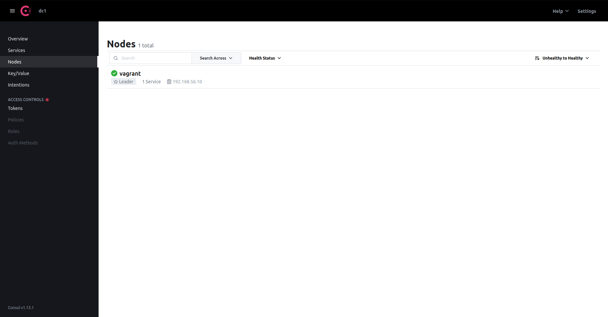
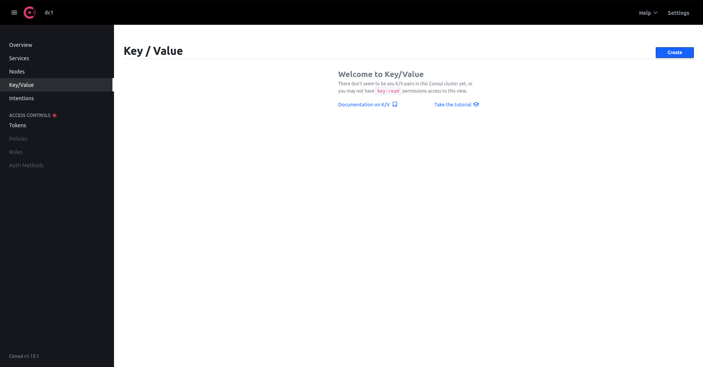

# Consul

## Ports table

| Use | Default ports |
| --- | ------------- |
| DNS(TCP and UDP) | 8600 |
| HTTP API (TCP only) | 8500 |
| HTTPS API | disabled (by recomendation 8501) |
| gRPC API | disabled (by recomendation 8502) |
| The Serf LAN port (TCP and UDP) | 8301 |
| The Serf WAN port (TCP and UDP) | 8302 |
| Server RPC address (TCP only) | 8300 |
| Sidecard Proxy min (inclusive min port number) | 21000 |
| Sidecard Proxy max (inclusive max port number) | 21255 |

## UI walk through

We can access to the Web page that consul exposes through this [url](http://localhost:8500/ui/dc1/services).

### Services

List all the services in the datacenter.

Inside each service, we can specify a _Health Check_, so we can ensure that the targeted port is listening to requests for example.
(If you have only the Consul instance inside the webpage, you will see that it doesn't have any check, which makes sense, because it is not self-checking)

Then we have the "All node checks passing", which are checks that targets a node, and it it fails, we consider that all the services inside that node, are not healthy.

### Nodes

List all the nodes in this datacenter.

- On kubernetes, this will show all your kubernetes nodes.
- On VMs, this will show all the VMs that consul clients and servers are deployed onto.

### Key value

This is a Key-value database. It is not needed for service mesh configuration, so we are not going into detail.

### Intentions

Intentions are rules about which service can talk to which other services.

### Wait! CLI time

Connect to your vagrant instance using `vagrant ssh` from the same directory you created it.

Some commands:

- `consul catalog services` -> Displays all the services
- `consul catalog nodes` -> Displays all the nodes

### Using API

- `curl http://localhost:8500/v1/catalog/services?pretty`
- `curl http://localhost:8500/v1/catalog/nodes?pretty`
