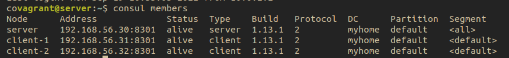

# Agents overview

## Lab

We are going to setup a nearly production cluster to understand how consul server and clients operate between them.

## Lifecycle

- *An agent is started* either manually or through an automated or programatic process.
- *An agent joins a cluster*, which enables the agent to discover agent peers. Agents join the cluster on startup when the `join` command is issued or the `auto-join` configuration.
- *Information about the agent is gossiped  to the entire cluster*. As a result, all nodes will eventually become aware of each other.
- *Existing servers will begin replicating to the new node* if the agent is a server.

## Setting up the server

- `datacenter`: It is the name of our datacenter. It is the one that wrap everything we are going to build now.
- `data_dir`:
  + Data directory for the agent to *store data*.
  + **Required**
  + The directory *should be durable* across reboots.
  + This is specially critical for agents that are running in server mode as they must be able to persist *cluster state*.
  + Additionally, the dir must support use of filesystem locking (concurrent system).
  + Files are written with `0600` permission. Just ensure that no other process can access these files, because *server* and *non-server* may store _ACL_ tokens in the state in this directory.
  + [more reference](https://www.consul.io/docs/agent/config/cli-flags#_data_dir)
- `bootstrap_expect`:
  + Number of expected servers in the datacenter.
  + This allows to Consul to just wait until the specified number of servers are available and then bootstrap the server.
  + [more reference](https://www.consul.io/docs/agent/config/cli-flags#_bootstrap_expect)
- `bind_addr`:
  + The address that should be bound to for *internal cluster communications*.
  + This IP address should be reachable by other consul servers.
  + [more reference](https://www.consul.io/docs/agent/config/cli-flags#_bind)
- `client_addr`:
  + The address to which Consul will bind client interfaces, including the *HTTP* and *DNS* servers.
  + By default, this is "127.0.0.1", allowing only loopback connections.
  + It is preferable to attach to 0.0.0.0, which means any network interface.
  + [more reference](https://www.consul.io/docs/agent/config/cli-flags#_client)

## Proof

## Setting up the client

- `retry_join`:
  + [more reference](https://www.consul.io/docs/agent/config/cli-flags#retry-join)

