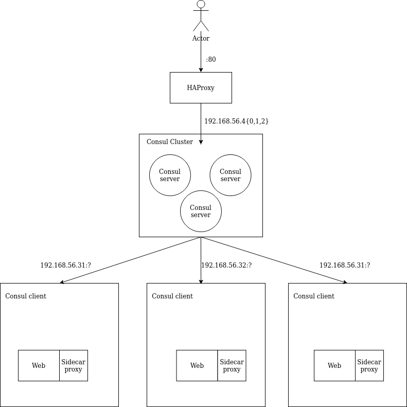

# Consul cluster with haproxy as load balancer

## Architecture

## TODO

- Create a centralized log system so we can observe the nginx, haproxy and consul logs.
- Create a DNS server that redirects `*.consul.` DNS queries to consul cluster.

