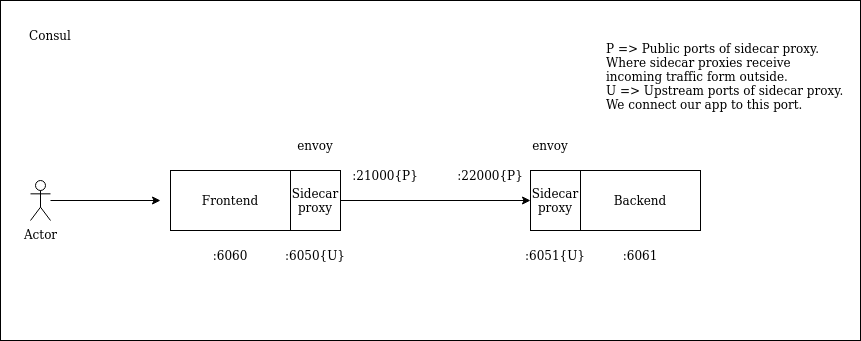

# Services in Consul

## Service config file

```hcl
service {
# It is recommended to use characters allowed to use in DNS names
  name = "servicename"
# If we use the same name for more than one service, we must use a different id. By default, the name will be used as id, if id is not specified
  id   = "serviceid" 
# List of strings values that can be used to add service-level labels.
  tags = [
    "myfirstlabel",
    "mysecondlabel"
  ]
# Port where the service is running
  port = 80

}
```

## Lab architecture



## Installation

Go to this [folder](./vm) and run `vagrant up`. It will try to get up and running a virtualbox machine, so you need to have virtualbox installed.

## Verification

Go [here](http://192.168.56.30:6060/index) and check that you can see a table with some "users" (This is not a lab about big data, so don't care about it).

## Purpose

The purpose of this lab is to get hands on with Consul and be familiar with it. We are exposing each of the services in a static manner and configuring it to Cosul on the same manner, so it is no so challenging to Consul to discover that services. In chapter 5, we are going to discover dynamically services using a Consul client... Stay tunned.

## Folder structure

*services* is composed of two *microservices* (although they are running as daemon processes at bare metal environment)

- frontend: contains all the web page stuff.
- backend: contains all the backend stuff.

Inside each of them, we have:

- `app-sidecar-proxy.service` => Is the service that starts the Envoy sidecar proxy (the one that wraps each application)
- `app.service` => Is the service that starts the frontend|backend application. Just another Daemon.
- `app.hcl` => Includes the configuration for the service inside the consul ecosystem.
- `Dockerfile` => Just for testing, probably in the future, we can create another lab with Docker swarm and/or K8s.
- `main.go` => Contains all the source code.
- `Makefile` => Is the reponsible of moving folders to the correct destination.

*compose* folder contains the microservice architecture of the two apps, just for testing, at least by now.

Inside the *vm* folder, we have the main `consul.service`, which configures some basic stuff about the service.

We are using *Ansible* to deploy our services because of its simplicity:

- Installing Consul and Envoy (not an easy task, OMG).
- Configuring services as daemons.
- Running the all the processes.

Last but not least, we have the `server.hcl` which configures the gRPC port of the consul environment, at which IP address the process should bind, etc.

## Reference

- [Tutorial](https://learn.hashicorp.com/tutorials/consul/get-started-service-discovery?utm_source=docs)
- [Services](https://www.consul.io/docs/discovery/services)
- [Health check](https://www.consul.io/docs/discovery/checks)
- [apt-key-deprecated-solution](https://itsfoss.com/apt-key-deprecated/)
- [warning-apt-key](https://stackoverflow.com/questions/68992799/warning-apt-key-is-deprecated-manage-keyring-files-in-trusted-gpg-d-instead/71384057#71384057)
- [apt-key-managing-ansible](https://stackoverflow.com/questions/71585303/how-can-i-manage-keyring-files-in-trusted-gpg-d-with-ansible-playbook-since-apt)

